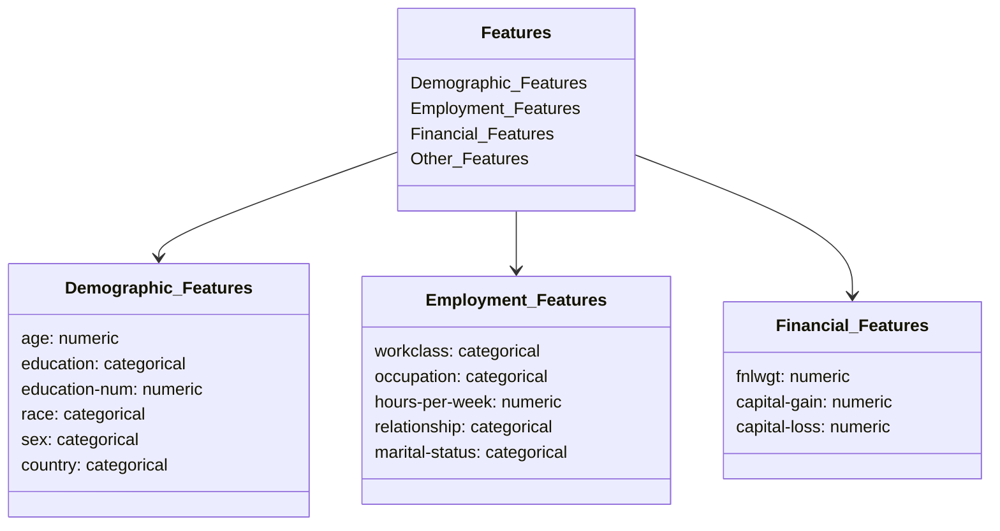

# MWC-Module-3-Modular-Workflow-and-Project-Setup-Basics

# Problem Statement:

## Business Context:

The project aims to develop a machine learning system that predicts individual income levels based on demographic and employment data.

The prediction boundary is set at $50,000 annually (binary classification problem).

The solution will help in understanding socio-economic factors affecting income levels.

Enable data-driven decision making for policy makers and financial institutions.

Identify key socio-economic factors influencing income disparities.

Support targeted intervention programs for economic development

## Key Stakeholders

**Policy Makers:** For evidence-based policy development

**Financial Institutions:** For risk assessment and product development

**Social Services:** For resource allocation and program planning

**Research Organizations:** For socio-economic studies

# Dataset Details:
Let's visualize the data structure and features:

